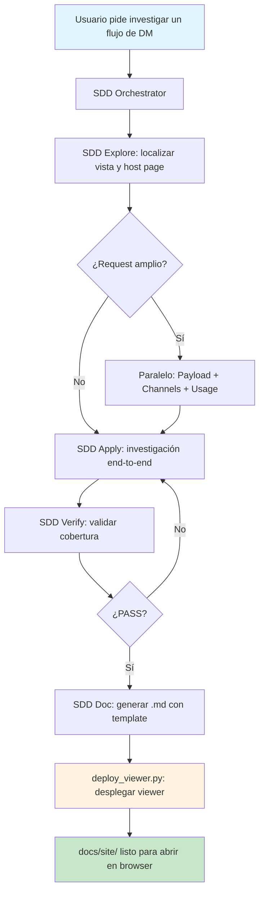

# SDD — Search-Driven Discovery for Data Managers

> Sistema de agentes de IA para investigación automatizada de flujos de Data Managers (DM) en aplicaciones Cells / Polymer. Traza la cadena completa de servicios, documenta automáticamente en Markdown, y despliega un viewer HTML interactivo — sin código frontend generado por la IA.

---

## ¿Qué es SDD?

SDD es un **pipeline de investigación guiado por IA** diseñado para analizar repositorios de aplicaciones web basadas en el framework [Cells](https://platform.bbva.com/en-us/development/cells) (Polymer/Lit). Su objetivo es:

1. **Trazar flujos completos de Data Managers**: desde la pantalla visible hasta el endpoint backend, pasando por host pages, canales, payloads y navegación downstream.
2. **Documentar la cadena de servicios**: qué servicios llama el DM, en qué orden, qué responde cada uno, y cómo los parámetros de respuesta alimentan la siguiente llamada.
3. **Generar documentación automática**: Markdown profesional con diagramas Mermaid, desplegado con un viewer interactivo que incluye zoom, búsqueda y TOC.

### ¿Para quién es?

Para equipos de desarrollo que necesitan:

- Entender flujos heredados sin depender de la persona que los escribió
- Documentar técnicamente DMs para onboarding de nuevos desarrolladores
- Investigar cadenas de servicios (BGDM → BGADP → Provider → Endpoint) con evidencia de código
- Mantener un wiki técnico vivo dentro del repositorio

---

## Arquitectura

```
┌─────────────────────────────────────────────────────────────┐
│                    SDD Orchestrator                         │
│            (Coordinador principal de agentes)              │
│                                                             │
│   Decide qué agentes llamar, en qué orden, y sintetiza    │
│   los resultados antes de pasar al siguiente.              │
└──────────┬──────────────────────────────────────────────────┘
           │
           │  Delega a agentes especializados:
           │
    ┌──────┼──────────────────────────────────────────┐
    │      │                                          │
    ▼      ▼          ▼          ▼          ▼         ▼
┌──────┐┌──────┐┌──────┐┌──────┐┌──────┐┌──────┐┌──────┐
│ Init ││Explore││ Spec ││Tasks ││Apply ││Verify││ Doc  │
└──────┘└──────┘└──────┘└──────┘└──────┘└──────┘└──────┘
    │                                        │       │
    │   Agentes de investigación paralela:   │       │
    │   ┌─────────┐ ┌──────────┐ ┌───────┐  │       │
    │   │ Payload │ │ Channels │ │ Usage │  │       │
    │   └─────────┘ └──────────┘ └───────┘  │       │
    │                                        │       │
    └────────────────────────────────────────┘       │
                                                      │
                              ┌────────────────────────┘
                              ▼
                    ┌─────────────────┐
                    │  Docs Viewer    │
                    │  (deploy_       │
                    │   viewer.py)    │
                    └────────┬────────┘
                             │
                             ▼
                    docs/site/index.html
                    (Viewer pre-construido)
```

---

## Pipeline de investigación

El pipeline sigue una secuencia de fases, cada una con su agente y skill correspondientes:

| Fase | Agente | Skill | Propósito |
|------|--------|-------|-----------|
| **1. Init** | `SDD Init` | `sdd-init` | Perfilado del repositorio: estructura, fuentes de verdad, topología |
| **2. Explore** | `SDD Explore` | `sdd-explore` | Localizar vista, ruta, host page, y punto de entrada |
| **3. Spec** | `SDD Spec` | `sdd-spec` | Convertir el request en un scope verificable y no ambiguo |
| **4. Tasks** | `SDD Tasks` | `sdd-tasks` | Generar checklist operacional ejecutable paso a paso |
| **5. Apply** | `SDD Apply` | `sdd-apply` | Ejecutar la investigación real: trazar DM, servicios, payload, channels |
| **6. Verify** | `SDD Verify` | `sdd-verify` | Validar cobertura y consistencia antes de cerrar |
| **7. Doc** | `SDD Doc` | `sdd-doc` | Persistir la investigación como documentación en `docs/flows/` |
| **8. Viewer** | — | `sdd-docs-viewer` | Desplegar el viewer HTML pre-construido en `docs/site/` |

### Agentes de investigación paralela

Para requests amplios (e.g. "dame el flujo completo, payload, channels, y usos del DM"), el orchestrador puede ejecutar en paralelo:

| Agente | Propósito |
|--------|-----------|
| `SDD Payload` | Params, body, helpers, y origen de cada campo |
| `SDD Channels` | Publish/subscribe, navegación, continuidad downstream |
| `SDD Usage` | Dónde y cómo se usa el DM en el proyecto |

---

## Estructura del proyecto

```
dm-agents-teams/
│
├── .github/
│   ├── agents/                          ← Definiciones de agentes
│   │   ├── sdd-orchestrator.agent.md    ← Coordinador principal
│   │   ├── sdd-apply.agent.md           ← Worker: investigación
│   │   ├── sdd-doc.agent.md             ← Worker: documentación
│   │   ├── sdd-explore.agent.md         ← Worker: exploración
│   │   ├── sdd-init.agent.md            ← Worker: perfilado
│   │   ├── sdd-spec.agent.md            ← Worker: especificación
│   │   ├── sdd-tasks.agent.md           ← Worker: checklist
│   │   ├── sdd-verify.agent.md          ← Worker: verificación
│   │   ├── sdd-payload.agent.md         ← Worker: payload
│   │   ├── sdd-channels.agent.md        ← Worker: channels
│   │   └── sdd-usage.agent.md           ← Worker: uso del DM
│   │
│   ├── skills/                          ← Skills (lógica de cada fase)
│   │   ├── _shared/                     ← Referencias compartidas
│   │   │   ├── open-spec.md             ← Framework operativo
│   │   │   ├── base-agent-logic.md      ← Lógica de investigación
│   │   │   ├── repo-investigation-map.md← Dónde buscar en el repo
│   │   │   ├── planning-contract.md     ← Contrato de planificación
│   │   │   ├── output-contract.md       ← Contrato de entrega
│   │   │   └── developer-docs-convention.md ← Convención de docs
│   │   │
│   │   ├── sdd-init/                    ← Perfilado del repo
│   │   ├── sdd-explore/                 ← Exploración de vistas
│   │   ├── sdd-spec/                    ← Especificación de scope
│   │   ├── sdd-tasks/                   ← Generación de checklist
│   │   ├── sdd-apply/                   ← Investigación end-to-end
│   │   ├── sdd-verify/                  ← Validación de cierre
│   │   ├── sdd-doc/                     ← Documentación
│   │   │   └── templates/
│   │   │       └── dm-flow-doc-template.md ← Template de 13 secciones
│   │   ├── sdd-docs-viewer/             ← Viewer pre-construido
│   │   │   ├── assets/                  ← HTML, JS, CSS (pre-built)
│   │   │   ├── scripts/
│   │   │   │   ├── deploy_viewer.py     ← EL script principal
│   │   │   │   ├── refresh_viewer.py    ← Re-deploy (legacy)
│   │   │   │   └── build_manifest.py    ← Solo rebuild manifest
│   │   │   └── references/              ← Reglas del viewer
│   │   └── sdd-design-doc-mermaid/      ← Guías de diagramas Mermaid
│   │
│   └── docs/
│       └── site/                        ← Viewer exportado
│
└── .agents/
    └── skills/                          ← Skills adicionales
```

---

## Componentes clave

### 1. Referencias compartidas (`_shared/`)

Los 6 archivos que definen las reglas transversales del sistema:

| Archivo | Rol |
|---------|-----|
| `open-spec.md` | Framework operativo: cómo investiga la IA, topologías, cierre |
| `base-agent-logic.md` | Secuencia obligatoria de investigación (13 pasos) |
| `repo-investigation-map.md` | Dónde buscar en la estructura del repo |
| `planning-contract.md` | Fases de planificación (7 fases incluyendo docs) |
| `output-contract.md` | Contrato de entrega y closure checklist |
| `developer-docs-convention.md` | Convención de documentación para desarrolladores |

### 2. Template de documentación (`dm-flow-doc-template.md`)

Template de **13 secciones numeradas** que la IA llena basándose en evidencia de código:

1. Resumen ejecutivo
2. Origen de la vista
3. **Clasificación de componentes** (node_modules vs app-local vs platform)
4. Perfil técnico del DM
5. **Cadena de llamadas a servicios** (orden, respuestas, mapeo de parámetros)
6. Ramas lógicas
7. Payload (request/response)
8. Canales (consumidos/publicados)
9. Navegación downstream
10. Reutilización del DM
11. Errores técnicos
12. **Hallazgos críticos** (severidad 🔴🟡⚪)
13. Conclusión y gaps

### 3. Viewer pre-construido (`sdd-docs-viewer/`)

Un viewer HTML/JS/CSS **completamente pre-construido** que la IA nunca genera desde cero. Características:

- 📂 Sidebar con navegación por categorías y búsqueda
- 📑 Table of Contents auto-generado desde headings
- 🔍 **Zoom en diagramas Mermaid** (+/−/fullscreen/reset/Ctrl+wheel)
- ⌨️ Navegación por teclado entre documentos
- 📱 Responsive (hamburger menu en móvil)
- ⏱️ Estimación de tiempo de lectura
- 🔗 Hash navigation para enlaces directos a secciones

---

## Cómo funciona (flujo completo)



### Cadena de cierre obligatoria

Cada investigación completa **DEBE** terminar con:

1. **`sdd-doc`** → persiste el `.md` en `docs/flows/`
2. **`deploy_viewer.py`** → scaffolds `docs/` + despliega viewer + genera manifest
3. **Verificación** → confirma que `index.html`, `app.js`, `styles.css`, `manifest.json` existen

La IA **nunca** genera HTML/JS/CSS. Solo escribe el `.md` y ejecuta el script.

---

## Cómo usar

### Requisitos

- [VS Code](https://code.visualstudio.com/) con extensión de agentes IA (GitHub Copilot / similar)
- Python 3.10+
- Un repositorio Cells/Polymer para analizar

### Inicio rápido

1. Abre el proyecto en VS Code
2. Activa el agente `SDD Orchestrator`
3. Escribe un prompt como:

   > Investiga el flujo del DM de simulación de crédito. Quiero saber qué servicios llama, en qué orden, qué payload recibe, los canales que usa, y dónde continúa el flujo.

4. El orchestrador delegará automáticamente a los agents especializados
5. Al terminar, se generará:
   - `docs/flows/<slug>.md` — documentación técnica
   - `docs/site/` — viewer interactivo

### Desplegar el viewer manualmente

```bash
python .github/skills/sdd-docs-viewer/scripts/deploy_viewer.py --target-repo /path/to/repo
```

### Verificar un despliegue existente

```bash
python .github/skills/sdd-docs-viewer/scripts/deploy_viewer.py --target-repo /path/to/repo --verify-only
```

---

## Principios de diseño

| Principio | Implementación |
|-----------|---------------|
| **Evidencia, no inferencia** | La IA solo documenta lo que confirma en el código fuente |
| **Foco en servicios, no en UI** | El template prioriza cadena de servicios sobre pantallas |
| **Cero tokens en frontend** | El viewer es pre-construido, se despliega con un script |
| **Foco en el flujo pedido** | La IA no deriva a flujos tangenciales ni DMs no relacionados |
| **Documentación limpia** | Mínimas source citations, solo en puntos clave de evidencia |
| **Cierre automático** | Docs + viewer se generan sin que el usuario lo pida manualmente |
| **Agnóstico de proyecto** | Funciona con cualquier repo Cells/Polymer, no está hardcodeado a un flujo específico |

---

## Stack técnico

| Capa | Tecnología |
|------|-----------|
| Agentes | VS Code Agent Protocol (`.agent.md`) |
| Skills | Markdown con YAML frontmatter (`.SKILL.md`) |
| Scripts | Python 3.10+ |
| Viewer | HTML5 + Vanilla JS + CSS (pre-built, sin frameworks) |
| Diagramas | Mermaid.js (CDN) |
| Markdown rendering | marked.js (CDN) |
| Documentación | Markdown con template de 13 secciones |

---

## Licencia

MIT

---

## Autor

D.M
