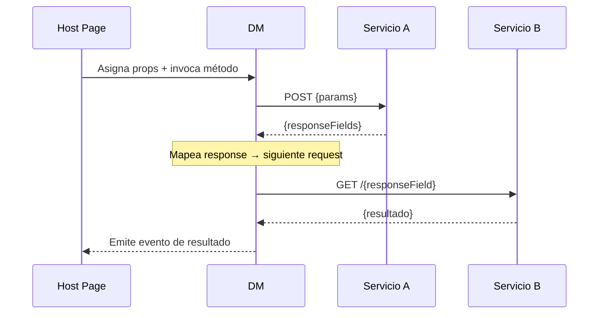

<!-- markdownlint-disable MD033 MD040 MD041 MD042 MD060 -->

# [Nombre del DM / Título del Flujo]

> Documentación técnica para desarrolladores. Foco: cadena de servicios, Data Manager, y lógica backend. Mantener conciso, profesional, y basado en evidencia de código. Minimizar detalles de UI visual.
> **Leyenda de evidencia:** `[CONFIRMED]` = verificado directamente en código · `[INFERRED]` = deducido a partir de evidencia confirmada · `[NOT FOUND]` = buscado y no localizado

[1-2 párrafos de introducción: alcance del flujo, qué DM lo procesa, qué datos maneja.]

---

## 1. Resumen ejecutivo

| Item                    | Detalle                                    |
|-------------------------|--------------------------------------------|
| DM principal            | [El DM que ejecuta la operación real]      |
| Topología               | [Package-backed / App-local / App-only]    |
| Método principal        | [dm.method(params, body)]                  |
| Lógica principal        | [Qué datos se transforman o procesan]      |
| Estado                  | Verificado / Parcial                       |
| Evidencia global        | [CONFIRMED / INFERRED / NOT FOUND]         |
| Última actualización    | [YYYY-MM-DD]                               |

---

## 2. Origen de la vista

| Campo                  | Evidencia                                   | Estado |
|------------------------|---------------------------------------------|--------|
| Pantalla de entrada    | [nombre visible]                            | [CONFIRMED/INFERRED/NOT FOUND] |
| Ruta interna           | [/route-name]                               | [CONFIRMED/INFERRED/NOT FOUND] |
| Host page              | [app/pages/page/page.js L###]               | [CONFIRMED/INFERRED/NOT FOUND] |
| Evento disparador      | [on-action-button → handler(detail)]        | [CONFIRMED/INFERRED/NOT FOUND] |
| Navegación             | [navigate → /destination-route]             | [CONFIRMED/INFERRED/NOT FOUND] |

---

## 3. Clasificación de componentes

En Cells, los componentes pueden venir de `node_modules`, del código local, o de la plataforma directa. Clasificar cada pieza:

| Tag                    | Rol              | Origen              | Paquete / Ruta                         | Estado |
|------------------------|------------------|----------------------|----------------------------------------|--------|
| [cells-co-*-ui]        | UI Component     | [node_modules]       | [@cvid-lit-component/...]              | [CONFIRMED/INFERRED/NOT FOUND] |
| [cells-co-*-dm-lit]    | DM               | [node_modules]       | [@cvid-lit-component/...]              | [CONFIRMED/INFERRED/NOT FOUND] |
| [host-page]            | Orquestador      | app-local            | [app/pages/.../page.js]                | [CONFIRMED/INFERRED/NOT FOUND] |

> **Topología**: [Package-backed / App-local DM / App-only] — [justificación breve].

---

## 4. Perfil técnico del DM

| Aspecto                | Evidencia                                   | Estado |
|------------------------|---------------------------------------------|--------|
| Custom element         | [tag-name]                                  | [CONFIRMED/INFERRED/NOT FOUND] |
| Archivo fuente         | [path]                                      | [CONFIRMED/INFERRED/NOT FOUND] |
| Versión                | [x.y.z]                                     | [CONFIRMED/INFERRED/NOT FOUND] |
| Properties clave       | [propA, propB]                              | [CONFIRMED/INFERRED/NOT FOUND] |
| Métodos públicos       | [method1(), method2()]                      | [CONFIRMED/INFERRED/NOT FOUND] |
| Eventos emitidos       | [on-response-*, on-post-*]                  | [CONFIRMED/INFERRED/NOT FOUND] |
| Dependencias           | [BGDM / BGADP / Provider]                  | [CONFIRMED/INFERRED/NOT FOUND] |

### Métodos y datos

| Método / Propiedad     | Propósito                    | Modifica estado |
|------------------------|------------------------------|-----------------|
| [method]               | [descripción]                | sí / no         |

```mermaid
classDiagram
  class [DmName] {
    +[method](payload) void
    -validatePayload(input) Object
  }
  class [Provider] {
    +[apiMethod](params, body) Promise
  }
  [DmName] --> [Provider] : invoca
```

---

## 5. Cadena de llamadas a servicios

### Orden y mapeo de parámetros

| #  | Servicio / Endpoint        | Método | Request params clave                  | Response usada downstream              | Estado |
|----|---------------------------|--------|---------------------------------------|-----------------------------------------|--------|
| 1  | [/api/endpoint]           | [POST] | [param1, param2]                      | [responseField1, responseField2]        | [CONFIRMED/INFERRED/NOT FOUND] |
| 2  | [/api/endpoint/{id}]      | [GET]  | [responseField1 ← del paso 1]        | [field3, field4]                        | [CONFIRMED/INFERRED/NOT FOUND] |

### Flujo de parámetros entre servicios



---

## 6. Payload

### Request (entrada)

| Campo    | Tipo         | Origen                    | Requerido | Estado |
|----------|--------------|---------------------------|-----------|--------|
| [campo]  | [tipo]       | [canal / formulario / DM] | sí / no   | [CONFIRMED/INFERRED/NOT FOUND] |

### Response (salida)

| Campo    | Tipo         | Destino                   | Estado |
|----------|--------------|---------------------------|--------|
| [campo]  | [tipo]       | [canal / navegación / UI] | [CONFIRMED/INFERRED/NOT FOUND] |

---

## 7. Canales

### Consumidos (entrada)

| Canal                  | Datos leídos              | Uso en el DM                          | Estado |
|------------------------|---------------------------|---------------------------------------|--------|
| [canal]                | [{ field1, field2 }]      | [asignado a prop X]                   | [CONFIRMED/INFERRED/NOT FOUND] |

### Publicados (salida)

| Canal                  | Payload                   | Cuándo se publica                     | Estado |
|------------------------|---------------------------|---------------------------------------|--------|
| [canal]                | [{ field1, field2 }]      | [tras éxito / al navegar]             | [CONFIRMED/INFERRED/NOT FOUND] |

---

## 8. Navegación downstream

```
/ruta-actual (host-page)
│
├── [Acción A] → /ruta-destino-a
│                  └── happy path → /ruta-final
│                  └── error → /ruta-error
│
└── [Error técnico] → /ruta-error
```

---

## 9. Reutilización del DM

| Página / Flujo  | Método / indicador usado         | Diferencia clave                       |
|-----------------|----------------------------------|----------------------------------------|
| [page]          | [method / indicator]             | [qué cambia respecto al flujo actual]  |

---

## 10. Errores técnicos

| Código | Handler              | Comportamiento                                |
|--------|----------------------|-----------------------------------------------|
| [code] | [handlerName()]      | [retry → logDown / modal → redirect]          |

---

## 11. Hallazgos críticos

| ID   | Severidad  | Descripción                              | Archivo L###             |
|------|------------|------------------------------------------|--------------------------|
| CF-1 | 🔴 Alta    | [hallazgo]                               | [file.js L###]           |
| CF-2 | 🟡 Media   | [hallazgo]                               | [file.js L###]           |

---

## 12. Conclusión

[1-2 párrafos: qué DM ejecuta la operación, qué fue verificado, qué queda pendiente.]

---

## 13. Gaps o preguntas abiertas

- [rama que no quedó clara]
- [mapeo de API sin evidencia]
- [elemento rastreado pero no encontrado en código]

<!-- markdownlint-enable MD033 MD041 MD042 -->
